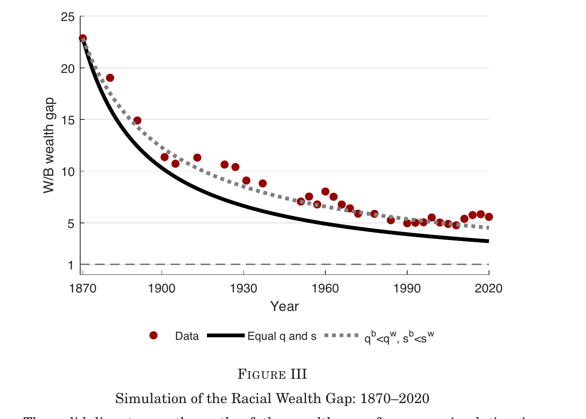
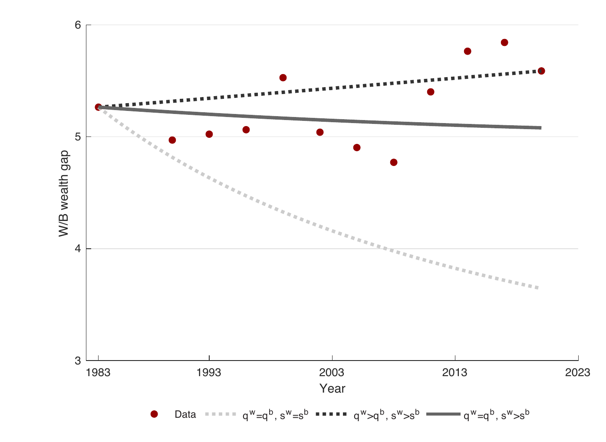

## Plan for today

```{r setup_getting_started, include=FALSE, purl=FALSE}
library(pacman)
p_load(
  broom, tidyverse,
  ggplot2, ggthemes, ggforce, viridis, extrafont, gridExtra,
  dplyr, here, magrittr
)
chap <- 2
lc <- 0
rq <- 0
# **`r paste0("(LC", chap, ".", (lc <- lc + 1), ")")`**
# **`r paste0("(RQ", chap, ".", (rq <- rq + 1), ")")`**

knitr::opts_chunk$set(
  tidy = FALSE, 
  out.width = '\\textwidth', 
  fig.height = 4,
  fig.align='center',
  warning = FALSE
  )

options(scipen = 99, digits = 3)

# Set random number generator see value for replicable pseudorandomness. Why 76?
# https://www.youtube.com/watch?v=xjJ7FheCkCU
set.seed(76)
#alternative way of loading data:
#githubURL <- ("https://raw.githubusercontent.com/jrm87/ECO3253_spring2026/main/rds/trials.rds")
#download.file(githubURL,"trials.rds", method="curl")
#data <- readRDS("trials.rds")
```

- Intergenerational Perspective of Racial Disparities

> Reference: [Chetty, Hendren, Jones, Porter. "Race and Economic Opportunity in the United States: An Intergenerational Perspective" QJE 2020](https://academic.oup.com/qje/article/135/2/711/5687353)

# An Intergenerational Perspective on Racial Disparities

## Median Household Income by Race and Ethnicity in 2016

```{r, echo=FALSE, out.width = '80%'}
knitr::include_graphics("../../images/lec9_race_ineq/medianhhinc2016_race.png")
```

## An Intergenerational Perspective on Racial Disparities

- Most prior work has studied racial disparities within a single generation

- We will take an intergenerational perspective, focusing on dynamics of income across generations

- Intergenerational approach sheds light on which disparities will persist in the long run and allows us to isolate the factors that drive persistent gaps

    - Methods: dynamics of income and steady states

## Intergenerational Mobility in the United States

Mean Child Household Income Rank vs. Parent Household Income Rank

```{r, echo=FALSE, out.width = '70%'}
knitr::include_graphics("../../images/lec9_race_ineq/mob1.png")
```

## Convergence in Black-White Gap if Intergenerational Mobility is Race-Invariant

```{r, echo=FALSE, out.width = '70%'}
knitr::include_graphics("../../images/lec9_race_ineq/mob2.png")
```


## Convergence in Black-White Gap if Intergenerational Mobility is Race-Invariant

```{r, echo=FALSE, out.width = '70%'}
knitr::include_graphics("../../images/lec9_race_ineq/mob3.png")
```

## Convergence in Black-White Gap if Intergenerational Mobility is Race-Invariant

```{r, echo=FALSE, out.width = '70%'}
knitr::include_graphics("../../images/lec9_race_ineq/mob4.png")
```

## Convergence in Black-White Gap if Intergenerational Mobility is Race-Invariant

```{r, echo=FALSE, out.width = '70%'}
knitr::include_graphics("../../images/lec9_race_ineq/mob5.png")
```

## Convergence in Black-White Gap if Intergenerational Mobility is Race-Invariant

```{r, echo=FALSE, out.width = '70%'}
knitr::include_graphics("../../images/lec9_race_ineq/mob6.png")
```

## Convergence in Black-White Gap if Intergenerational Mobility is Race-Invariant

```{r, echo=FALSE, out.width = '70%'}
knitr::include_graphics("../../images/lec9_race_ineq/mob7.png")
```

## Convergence in Black-White Gap if Intergenerational Mobility is Race-Invariant

```{r, echo=FALSE, out.width = '70%'}
knitr::include_graphics("../../images/lec9_race_ineq/mob8.png")
```


## Intergenerational Mobility for Whites vs. Blacks

```{r, echo=FALSE, out.width = '70%'}
knitr::include_graphics("../../images/lec9_race_ineq/mob_b_w1.png")
```


## Intergenerational Mobility for Whites vs. Blacks

```{r, echo=FALSE, out.width = '70%'}
knitr::include_graphics("../../images/lec9_race_ineq/mob_b_w2.png")
```


## Intergenerational Mobility for Whites vs. Blacks

```{r, echo=FALSE, out.width = '70%'}
knitr::include_graphics("../../images/lec9_race_ineq/mob_b_w3.png")
```

## Intergenerational Mobility for Whites vs. Blacks

```{r, echo=FALSE, out.width = '70%'}
knitr::include_graphics("../../images/lec9_race_ineq/mob_b_w4.png")
```

## Intergenerational Mobility for Whites vs. Blacks

```{r, echo=FALSE, out.width = '70%'}
knitr::include_graphics("../../images/lec9_race_ineq/mob_b_w5.png")
```

## Mean Child Income Rank vs. Parent Income Rank by Race and Ethnicity

```{r, echo=FALSE, out.width = '70%'}
knitr::include_graphics("../../images/lec9_race_ineq/rank_parent_child_race1.png")
```

## Mean Child Income Rank vs. Parent Income Rank by Race and Ethnicity

```{r, echo=FALSE, out.width = '70%'}
knitr::include_graphics("../../images/lec9_race_ineq/rank_parent_child_race2.png")
```

## Mean Child Income Rank vs. Parent Income Rank by Race and Ethnicity

```{r, echo=FALSE, out.width = '70%'}
knitr::include_graphics("../../images/lec9_race_ineq/rank_parent_child_race3.png")
```

## Mean Child Income Rank vs. Parent Income Rank by Race and Ethnicity

```{r, echo=FALSE, out.width = '70%'}
knitr::include_graphics("../../images/lec9_race_ineq/rank_parent_child_race4.png")
```

## Current Mean Ranks vs. Predicted Ranks in Steady State, by Race

```{r, echo=FALSE, out.width = '70%'}
knitr::include_graphics("../../images/lec9_race_ineq/predicted_ss.png")
```

## Intergenerational Persistence of Racial Disparities

- Black Americans are close to their long-run steady-state 

    - Suggests that intergenerational gaps (not transitory factors) drive most of the black-white gap today

- Addressing the black-white gap therefore requires understanding sources of intergenerational gaps

    - Why do black children earn less than white children who grow up in families with comparable incomes?

## Gender Differences in Racial Gaps

- First step in understanding this: examine differences by gender

- Focus on individual (own) income for this analysis, excluding spousal income

## Black-White Gap in Child Individual Income Rank vs. Parent Income Rank

Male Children

```{r, echo=FALSE, out.width = '70%'}
knitr::include_graphics("../../images/lec9_race_ineq/b_w_male.png")
```

## Black-White Gap in Child Individual Income Rank vs. Parent Income Rank

Female Children

```{r, echo=FALSE, out.width = '70%'}
knitr::include_graphics("../../images/lec9_race_ineq/b_w_female.png")
```

## Employment Rates vs. Parent Income Rank

Male Children

```{r, echo=FALSE, out.width = '65%'}
knitr::include_graphics("../../images/lec9_race_ineq/b_w_male_employment.png")
```

## Employment Rates vs. Parent Income Rank

```{r, echo=FALSE, out.width = '65%'}
knitr::include_graphics("../../images/lec9_race_ineq/b_w_male_employment_all.png")
```

## Incarceration Rates vs. Parent Income Rank

Male Children

```{r, echo=FALSE, out.width = '65%'}
knitr::include_graphics("../../images/lec9_race_ineq/b_w_male_incarceration.png")
```

## Incarceration Rates vs. Parent Income Rank

Female Children

```{r, echo=FALSE, out.width = '65%'}
knitr::include_graphics("../../images/lec9_race_ineq/b_w_female_incarceration.png")
```

## Explaining the Black-White Intergenerational Income Gap

Family-Level Factors:

- Do family-level factors (e.g., parental wealth, education, etc.) explain the black-white intergenerational gap?

    - No: Black men who grow up in two-parent families with comparable income, education, and wealth to white men still fare worse

- Suggests that environmental factors beyond the family matter

- Study the role of environmental factors by analyzing differences in black-white gaps across neighborhoods

## The Geography of Upward Mobility in the United States

```{r mobCZ, fig.cap="Source: [Chetty, Friedman, Hendren, Jones and Porter (2018)](https://utsa.instructure.com/courses/79928/files/folder/papers?preview=13306202)", echo=FALSE, out.width = '85%'}
knitr::include_graphics("../../images/mobility_CZ_chetty18.png")
```

## Two Americas: The Geography of Upward Mobility by Race

```{r, echo=FALSE, out.width = '90%'}
knitr::include_graphics("../../images/lec9_race_ineq/two_americas_b_w.png")
```

## Neighborhood Environments and the Black-White Gap

- Commuting-zone level variation illuminates broad regional patterns but does not directly test for “neighborhood” effects

- Blacks live in different neighborhoods from whites within CZs

- Zoom in to examine variation across Census tracts

## Variation in the Black-White Earnings Gap Across Tracts

Four key results:

1. Black boys have lower earnings than white boys in 99% of Census tracts in America, controlling for parental income

## Variation in the Black-White Earnings Gap Across Tracts

Four key results:

1. Black boys have lower earnings than white boys in 99% of Census tracts in America, controlling for parental income

2. Both black and white boys have better outcomes in “good” (e.g., low-poverty, higher rent) neighborhoods, but the black-white gap is bigger in such areas

## Correlations between Tract-Level Characteristics and Incomes of Black vs. White Men

```{r, echo=FALSE, out.width = '70%'}
knitr::include_graphics("../../images/lec9_race_ineq/correlation_tract_men_b_w.png")
```


## Black – White Gap in Individual Income Ranks vs. Share Above Poverty Line

```{r, echo=FALSE, out.width = '70%'}
knitr::include_graphics("../../images/lec9_race_ineq/pov_w_b_gap.png")
```

## Variation in the Black-White Earnings Gap Across Tracts

Four key results:

1. Black boys have lower earnings than white boys in 99% of Census tracts in America, controlling for parental income

2. Both black and white boys have better outcomes in “good” (e.g., low-poverty, higher rent) neighborhoods, but the black-white gap is bigger in such areas

3. Within low-poverty areas, there are two factors associated with better outcomes for black boys and smaller gaps: greater father presence and less racial bias

## Black-White Gap in Employment Rates vs. Father Presence

```{r, echo=FALSE, out.width = '90%'}
knitr::include_graphics("../../images/lec9_race_ineq/pov_w_b_gap2.png")
```

## Male-Female Gap in Employment Rates vs. Father Presence

```{r, echo=FALSE, out.width = '90%'}
knitr::include_graphics("../../images/lec9_race_ineq/pov_b_male_female_gap.png")
```

## Variation in the Black-White Earnings Gap Across Tracts

Four key results:

1. Black boys have lower earnings than white boys in 99% of Census tracts in America, controlling for parental income

2. Both black and white boys have better outcomes in “good” (e.g., low-poverty, higher rent) neighborhoods, but the black-white gap is bigger in such areas

3. Within low-poverty areas, there are two factors associated with better outcomes for black boys and smaller gaps: greater father presence and less racial bias

4. Neighborhoods have causal childhood exposure effects on racial gaps: black boys who move to good areas at a younger age do better

## Summary: Impacts of Neighborhood Environments on Black Men

- Black boys do well in nbhds. with good resources (low poverty rates) and good race-specific factors (e.g., high father presence, less racial bias)

- The problem is that there very few such neighborhoods in America…

# Racial Wealth Gap

## From income to wealth: why does it matter?

- So far everything we have looked at has been about **income**

- But the racial **wealth** gap is *much* larger than the income gap:

    - Black Americans earn about **50 cents** for every white dollar of income
    - But they hold only about **17 cents** for every white dollar of wealth
    - That is a white-to-Black wealth ratio of about **6 to 1** today

- Why is the wealth gap so much larger than the income gap? And why has it barely budged in the past 40 years?

> Reference: [Derenoncourt, Kim, Kuhn, Schularick (QJE 2024) "Wealth of Two Nations: The U.S. Racial Wealth Gap, 1860--2020"](https://academic.oup.com/qje/article/139/2/693/7404432)

## The challenge: we had no long-run data

- Most existing work studies the wealth gap **today** — using the Survey of Consumer Finances (SCF)

- But we had very limited information about how the wealth gap **evolved** since Emancipation

- Derenoncourt et al. build the **first continuous series** of the white-to-Black per capita wealth ratio going back to 1860

- They combine three sources:

    1. **1860--1920**: Southern state tax records + historical censuses (digitized by the authors for this paper)
    2. **1930s**: Monroe Work's *Negro Year Book* + census of agriculture
    3. **1950--2020**: historical waves of the Survey of Consumer Finances (SCF+)

- With this new 160-year series they ask a simple question: **what has driven the evolution of the racial wealth gap?**

## The big picture: a "hockey stick"

```{r, echo=FALSE, out.width = '65%'}
knitr::include_graphics("../../images/lec9_race_ineq/derenoncourt1.png")
```

*Source: [Derenoncourt et al. (QJE 2024), Figure I](https://academic.oup.com/qje/article/139/2/693/7404432)*

## Three distinct eras

Reading the hockey stick from left to right:

1. **1860: the wealth gap is 56 to 1.** On the eve of the Civil War, 89% of the Black population was enslaved and legally barred from owning any wealth. The average Black American had about **2 cents** for every white dollar of wealth

2. **1860--1870: gap falls from 56:1 to 23:1.** A stunning drop in a single decade --- more than 50%

3. **1870--1950: slow but steady convergence.** The gap falls from 23:1 to about 7:1 despite the rise of Jim Crow, the Ku Klux Klan, and systematic exclusion from land, credit, and labor markets

4. **1950--1980: civil-rights-era acceleration.** Gap narrows to about 5:1

5. **1980--today: the gap stalls and then *widens* again.** Today it is back to about 6:1 --- roughly where it was in 1950

## What drove the 1860--1870 collapse?

- Obvious guess: **freeing enslaved people eliminated "slave wealth"** that had been counted as white wealth

- The authors compute: removing slave wealth from white wealth in 1860 drops the gap from 56:1 to **47:1**

- But the actual 1870 gap is **23:1** --- eliminating slave wealth explains only about **27%** of the drop

- What explains the other 73%?

    - Land prices in the South collapsed after the war
    - Newly emancipated Black Southerners began rapidly accumulating property
    - Black per capita wealth **tripled** from ≈\$13 to ≈\$39 in one decade

- **Takeaway**: the post-Emancipation collapse in the gap is mostly a story of rapid *Black* wealth accumulation starting from almost nothing, not just accounting for slave wealth disappearing

## A framework for thinking about wealth

- Wealth grows through two channels:

    1. **Savings:** you earn income, you save a share $s$ of it, and that flow adds to your wealth
    2. **Capital gains:** the assets you already hold (housing, stocks) appreciate at rate $q$

- So the evolution of any group's wealth depends on:

    - **Initial wealth** (what you start with)
    - **Income growth** (how much you can save)
    - **Savings rate** $s$
    - **Return rate** $q$ on assets held

- Derenoncourt et al. ask: **which of these matters most** for the racial wealth gap?

## A thought experiment: what if Black and white Americans had had *equal* conditions since 1870?

- Take the observed income convergence between Black and white Americans as given
- Then **assume both groups had identical savings rates and capital gains rates** from 1870 onward
- Simulate: what would the wealth gap look like today?

## The equal-conditions benchmark

```{r, echo=FALSE, out.width = '70%'}

```

*Source: [Derenoncourt et al. (QJE 2024), Figure III](https://academic.oup.com/qje/article/139/2/693/7404432). Red dots: observed data. Solid black line: simulation with equal $q$ and $s$ from 1870.*

## What the simulation tells us

- Even under **equal** wealth-accumulating conditions since 1870, the 1870 gap of 23:1 would still only shrink to about **3:1** today

- And full convergence would be **more than 150 years away**

- Why? Because the 1870 starting point was so extreme that even equal flows take centuries to close a stock gap that large

- **Key intuition**: the legacy of slavery is a *wealth* legacy, not just an *income* legacy. Even if you gave Black and white Americans the same savings and returns starting in 1870, it would still take 300+ years to equalize wealth

- But wait --- the **observed** gap (red dots) is actually *above* the equal-conditions line. So the real world has been **even worse** than equal conditions. Why?

## The slow period (1870--1930): inferior conditions matter

- Between 1870 and 1930, observed convergence was **slower** than the equal-conditions benchmark would predict

- Not surprising --- this is the Jim Crow era:

    - Expropriation of Black property (Tulsa 1921, Rosewood 1923, etc.)
    - Exclusion from banks, credit, and land markets
    - Labor market discrimination
    - Legal segregation

- All of this translates into **lower savings and lower returns** for Black households relative to the equal-conditions counterfactual

- Civil rights era (1950--1980) temporarily reversed this --- Black wealth grew *faster* than the benchmark

- But then something new happened after 1980...

## The puzzle: the gap stopped closing after 1980

```{r, echo=FALSE, out.width = '65%'}

```

*Source: [Derenoncourt et al. (QJE 2024), Figure V](https://academic.oup.com/qje/article/139/2/693/7404432). Light dashed: equal $q$ and $s$. Solid: unequal savings only. Dark dashed: unequal $q$ and unequal $s$.*

## Reading Figure V

Three simulations, all starting from the 1983 gap of about 5.3:

- **Light dashed line** (equal $q$ and $s$): gap would have shrunk to about 3.6 by 2020
- **Solid line** (only unequal savings): gap roughly flat, not diverging
- **Dark dashed line** (unequal $q$ *and* unequal $s$): gap rises to 5.6 --- matches the data

**The only way to explain the post-1980 widening is if white households earn higher capital gains than Black households.** Not income differences. Not savings differences. **Capital gains.**

## Why the capital-gains gap? Portfolio composition

- Black and white households hold very different kinds of assets.
- Using the SCF+, the authors document average portfolio composition (1983--2019):

|                | Black | White |
|----------------|:-----:|:-----:|
| Housing        | **58%** | 39%  |
| Stocks         | 9%    | **18%** |
| Business       | 8%    | **19%** |
| Fixed income   | 16%   | 20%  |
| Other          | 9%    | 4%   |

- Black households hold nearly **60% of their wealth in housing**; white households hold a much larger share in stocks and business equity

*Source: [Derenoncourt et al. (QJE 2024), Table II](https://academic.oup.com/qje/article/139/2/693/7404432)*

## Why portfolio composition matters: asset prices

- Since 1980, housing prices have roughly kept up with inflation

- But the **stock market has boomed**: roughly **5x** the real appreciation of housing

- If your wealth is mostly in houses, you barely participated in that boom

- If your wealth is mostly in stocks and business equity, you got rich

- So the stock-market boom has **disproportionately benefited white households** --- not because of discrimination in a specific market, but because of whose wealth was already exposed to equity

## Capital gains counterfactual: what if only stocks had appreciated?

```{r, echo=FALSE, out.width = '65%'}
knitr::include_graphics("../../images/lec9_race_ineq/derenoncourt2.png")
```

*Source: [Derenoncourt et al. (QJE 2024), Figure VI Panel A](https://academic.oup.com/qje/article/139/2/693/7404432). Fix 1983 portfolios; let only equity (or only housing) appreciate.*

## Reading Figure VI

- **Dashed black line (only equity gains)**: the wealth gap would have **grown by 40%** (from 5.7 to 8.0)
- **Dashed gray line (only housing gains)**: the wealth gap would have **shrunk by 21%** (from 5.7 to 5.2)
- **Solid red line (actual data)**: the observed gap widened modestly

- Takeaway: the two forces partly offset each other, but **equity gains dominate** because equity appreciated so much more than housing

- If we give Black households housing gains and no equity gains, they lose ground to white households who get both

## Stepping back: what the paper tells us

Four lessons for thinking about the racial wealth gap:

1. **Initial conditions matter for centuries.** Starting at 56:1 in 1860 set a trajectory that even equal conditions cannot fully undo in 150 years --- let alone an environment of continued discrimination

2. **The post-1980 stall is not about income or savings.** Black-white income convergence stalled, but that alone does not explain the widening gap. The dominant force is that white households were more exposed to the stock-market boom

3. **Capital gains are the modern driver.** In a world of high wealth-to-income ratios, asset price movements matter more than savings flows

4. **Portfolio differences are the mechanism.** Black households' wealth is concentrated in housing; white households' wealth is more diversified into stocks and business equity --- assets that have boomed since 1980

