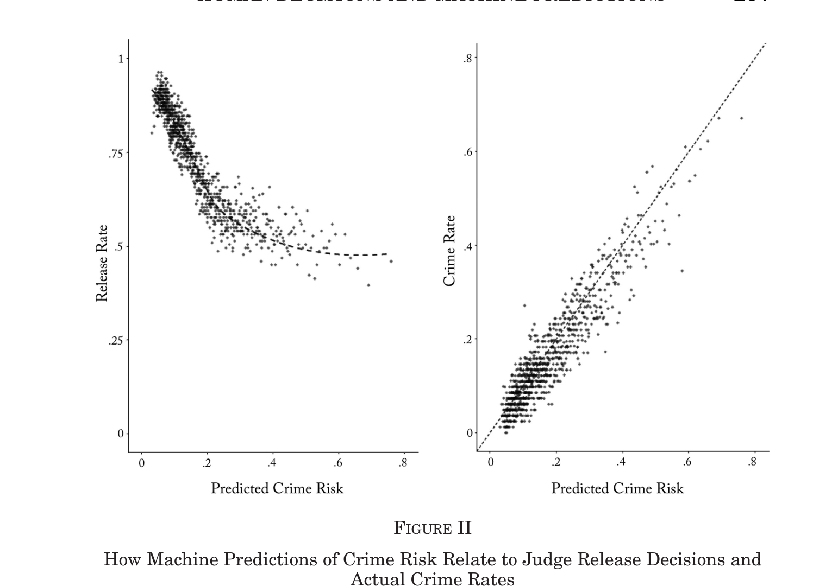
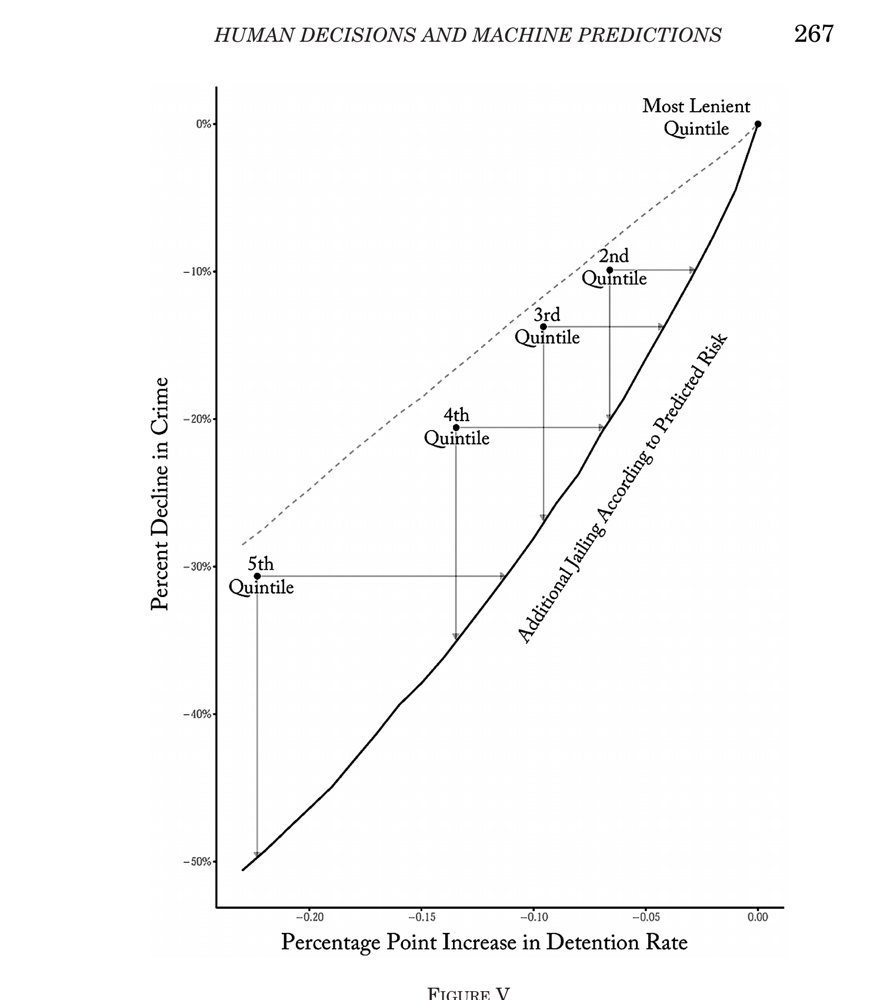
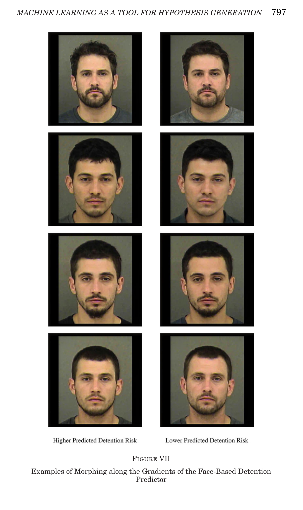

## Plan for today

```{r setup_getting_started, include=FALSE, purl=FALSE}
library(pacman)
p_load(
  broom, tidyverse,
  ggplot2, ggthemes, ggforce, viridis, extrafont, gridExtra,
  dplyr, here, magrittr
)
chap <- 2
lc <- 0
rq <- 0
# **`r paste0("(LC", chap, ".", (lc <- lc + 1), ")")`**
# **`r paste0("(RQ", chap, ".", (rq <- rq + 1), ")")`**

knitr::opts_chunk$set(
  tidy = FALSE, 
  out.width = '\\textwidth', 
  fig.height = 4,
  fig.align='center',
  warning = FALSE
  )

options(scipen = 99, digits = 3)

# Set random number generator see value for replicable pseudorandomness. Why 76?
# https://www.youtube.com/watch?v=xjJ7FheCkCU
set.seed(76)
#alternative way of loading data:
#githubURL <- ("https://raw.githubusercontent.com/jrm87/ECO3253_fall2026/main/rds/trials.rds")
#download.file(githubURL,"trials.rds", method="curl")
#data <- readRDS("trials.rds")
```

- Predictive Analytics in Criminal Justice
- Recent applications of Machine Learning to Social Issues

# Predictive Analytics in Criminal Justice

## Motivation: Biases in Human Decision Making

- Growing interest in using machine learning (predictive analytics) tools to aid decision makers, e.g. in the context of criminal justice

- Humans' decisions often exhibit substantial biases

- Begin by demonstrating this fact with a series of empirical examples

## Racial Discrimination in Hiring

- [Bertrand and Mullainathan (AER 2004)](https://utsa.instructure.com/courses/92072/files/folder/papers?preview=15424723) study biases in hiring by sending out fictitious resumes with identical credentials in response to real job ads

- Vary name of applicant to be “white-sounding” (e.g., Emily Walsh or Greg Backer) vs. “black-sounding” (e.g., Lakisha Washington or Jamal Jones)

- Send 5,000 resumes in response to 1,300 help-wanted ads in newspapers in Boston and Chicago

- Analyze call-back rates in response to application

## Job Callback Rates by Race for Resumes with Otherwise Identical Credentials

```{r, echo=FALSE, out.width = '75%'}
knitr::include_graphics("../../images/lec10_criminal_justice/bertrand1.png")
```

## Racial Discrimination Among Airbnb Hosts

- [Edelman, Luca, and Svirsky (AEJ Applied 2017)](https://www.aeaweb.org/articles?id=10.1257/app.20160213) use an analogous "audit study" to analyze discrimination among Airbnb hosts

- Send out fictitious requests to book listings in response to real postings

- Set up 20 independent accounts and sent 6400 messages to hosts from these accounts in 2015 

- Randomly vary name of applicant across accounts to be white vs. black sounding (and do not include profile pictures)

## AirBnB Host Response Rates by Race for Individuals with Otherwise Identical Profiles

```{r, echo=FALSE, out.width = '80%'}
knitr::include_graphics("../../images/lec10_criminal_justice/edellman1.png")
```
## Racial Discrimination Among Airbnb Hosts

- What happens to listings where offer was not accepted?

    - Roughly 40% of these listings remained vacant on proposed date

    - Rejecting black guests $\rightarrow$ loss of $65-$100 of revenue on average

## Biases due to Decision Fatigue

- Such biases in decisions are not driven entirely by deep-rooted beliefs

- Decisions also vary greatly based on transitory factors unrelated to substantive features of the issue at hand

- [Danziger, Levav, and Avnaim-Pesso (PNAS 2011)](https://www.pnas.org/doi/10.1073/pnas.1018033108) demonstrate this by analyzing data on judges' decisions to grant prisoners parole

## Studying Decision Fatigue in Parole Decisions

- Data: 1,100 judicial rulings on parole for prisoners in Israel over 10 months

- Judges review about 20 cases on average each day in succession

    - Ordering of cases depends upon when attorney shows up and is essentially random

- Judges can decide to grant parole or reject (delay to a future hearing, maintaining status quo)

- Key institutional feature: two breaks during the day for meals

    - 10 am for late-morning snack (40 mins)

    - 1 pm for lunch (1 hour) 

## Proportion of Rulings in Favor of Prisoner by Time of Interview During the Day

```{r, echo=FALSE, out.width = '80%'}
knitr::include_graphics("../../images/lec10_criminal_justice/danzinger1.png")
```

## Can Machines Help Humans Overcome Biases?

- Can machine learning help us reduce such biases?

- Idea: develop algorithms to predict outcomes of interest and use these to guide or replace human decisions

- These algorithms are not necessarily subject to human biases, but do they outperform humans’ decisions overall or have other biases/shortcomings?

## Decisions to Jail vs. Release Defendants

- [Kleinberg, Lakkaraju, Leskovec, Ludwig, Mullainathan (QJE 2018)](https://utsa.instructure.com/courses/92072/files/folder/papers?preview=15424725) compare the accuracy of human decisions and machine predictions in the criminal justice system

- Every year, about **10 million** people are arrested in the U.S.

- After arrest, judges decide whether to hold defendants in jail or let them go

- By law, decision is made with the objective of minimizing risk of flight (failure to appear at trial)

- [Kleinberg et al.](https://utsa.instructure.com/courses/92072/files/folder/papers?preview=15424725) compare machine learning predictions and judges' actual decisions in terms of performance in achieving this objective

## Decisions to Jail vs. Release Defendants

- Data: 750,000 individuals arrested in New York City between 2008-2013

    - Same data on prior history that is available to judge (rap sheet, current offense, etc.)

    - Data on subsequent crimes to develop and evaluate performance of algorithm

- Define “crime” as failing to show up at trial; objective is to jail those with highest risk of committing this crime

    - Other definitions of crime (e.g., repeat offenses) yield similar results

- First divide data into three separate samples

## Data Used for Empirical Analysis

```{r, echo=FALSE, out.width = '65%'}
knitr::include_graphics("../../images/lec10_criminal_justice/kleinberg1.png")
```

## Methodology: Machine Learning Using Decision Trees

- Predict probability of committing a crime using a machine learning method called decision trees

- Main statistical challenge: need to avoid overfitting the data with large number of potential predictors

    - Can get very good in-sample fit but have poor performance out-of-sample (analogous to issues with Google flu trend)

    - Solve this problem using cross-validation, using separate samples for estimation and evaluation of predictions
    
## Methodology: Machine Learning Using Decision Trees

Three steps to develop predictions using decision trees

1. Split the data based on the variable that is most predictive of differences in crime rates

## Hypothetical Decision Tree for Decision to Jail Defendant

```{r, echo=FALSE, out.width = '80%'}
knitr::include_graphics("../../images/lec10_criminal_justice/tree1.png")
```

## Methodology: Machine Learning Using Decision Trees

Three steps to develop predictions using decision trees

1. Split the data based on the variable that is most predictive of differences in crime rates

2. Grow the tree up to a given number of nodes N

## Hypothetical Decision Tree for Decision to Jail Defendant

```{r, echo=FALSE, out.width = '80%'}
knitr::include_graphics("../../images/lec10_criminal_justice/tree1.png")
```

## Hypothetical Decision Tree for Decision to Jail Defendant

```{r, echo=FALSE, out.width = '80%'}
knitr::include_graphics("../../images/lec10_criminal_justice/tree2.png")
```

## Hypothetical Decision Tree for Decision to Jail Defendant

```{r, echo=FALSE, out.width = '80%'}
knitr::include_graphics("../../images/lec10_criminal_justice/tree3.png")
```

## Methodology: Machine Learning Using Decision Trees

Three steps to develop predictions using decision trees

1. Split the data based on the variable that is most predictive of differences in crime rates

2. Grow the tree up to a given number of nodes N

3. Use separate validation sample to evaluate accuracy of predictions based on a tree of size N 

- Repeat steps 1-3 varying N and choose tree-size N that minimizes average prediction errors.

## Prediction Errors vs. Size of Decision Tree

```{r, echo=FALSE, out.width = '80%'}
knitr::include_graphics("../../images/lec10_criminal_justice/loss1.png")
```

## Comparing Machine Predictions to Human Predictions

- Applying this method yields predictions of crime rates for each defendant

- Machine-based decision rule: jail the defendants who have the highest predicted risk

- How does this machine-based rule compare to what judges actually do in terms of crime rates it produces?

- Answer is not obvious: judges can see things that are not in the case file, such as defendant’s demeanor in courtroom

## Judges' Release Decisions vs. Machine Predictions

```{r, echo=FALSE, out.width = '70%'}

```

*Source: [Kleinberg et al. (QJE 2018), Figure II](https://utsa.instructure.com/courses/92072/files/folder/papers?preview=15424725). Each dot is a 1000th-percentile bin of predicted risk.*

## What does Figure II tell us?

- **Left panel (judges vs. the algorithm).** At the low end of predicted risk, judges release more than 90% of defendants --- they mostly agree with the algorithm. But as predicted risk rises, the judges and the algorithm **disagree more and more**
- The riskiest 1% of defendants have a predicted crime rate of **62.6%**, yet judges release them at a rate of **48.5%**
- If the judges were just using a simple risk threshold, this curve would look like a step function. It does not --- judges release some very high-risk people

- **Right panel (is the algorithm right?).** The observed crime rate tracks predicted risk almost perfectly along the 45-degree line. So the defendants the algorithm *flags as risky are in fact risky*, even among those judges chose to release

## How do we compare judges to the algorithm?

- We'd like to ask: "if we replaced judges with the algorithm, how much crime could we prevent, holding the jail population constant?"

- The problem: we only observe crime for the **released** defendants. We never see what the detained ones would have done. Kleinberg et al. call this the **selective labels problem**

- Their fix: compare judges *to each other* using a **contraction procedure**

    - Start with the set of people the **most lenient** judges released
    - Add defendants to jail **one at a time**, in descending order of the algorithm's predicted risk
    - Compare the resulting crime curve to what the **stricter** judges actually produced

- This lets us benchmark against judges who faced similar defendants but made different choices --- no need to know the judge's secret risk threshold

## The algorithm beats every judge quintile

```{r, echo=FALSE, out.width = '40%'}

```

*Source: [Kleinberg et al. (QJE 2018), Figure V](https://utsa.instructure.com/courses/92072/files/folder/papers?preview=15424725).*

## Reading Figure V

- The four dots are the **2nd through 5th stricter quintiles** of judges. Each dot shows how much more they jailed and how much less crime they got, relative to the most lenient quintile

- The **solid black curve** is the algorithm's "contraction" path: what happens if we start from the most lenient quintile and jail additional defendants *by predicted risk*, not by judge preference

- **Every stricter judge quintile lies above the algorithm's curve**. For example:

    - Judges in the 2nd quintile: jail 6.6 pp more, reduce crime by 9.9%
    - Algorithm matching that crime reduction: needs only **2.8 pp** more jail (less than half)
    - Alternatively, at the same 6.6 pp extra jail, algorithm would cut crime by **20.1%** --- twice as much as judges

- The **dashed line** is the (mechanical) effect of randomly jailing people. The algorithm beats random, but the comparison that matters is against judges --- and it wins there too

## Does this come at the expense of racial equity?

- One worry: maybe the algorithm's gains come from locking up *more* minority defendants. Let's check

- **Same crime rate as judges**, but the algorithm can get there while jailing:

    - **40.8% fewer minorities** overall
    - **38.8% fewer Black defendants**
    - **44.6% fewer Hispanic defendants**

- Put differently: at the 2nd quintile's crime reduction, judges jail 7.9% more Black defendants; the algorithm needs only 3.7% more --- less than half

- So the algorithm doesn't just reduce crime or the jail population --- it reduces both **and** the racial disparity. Whatever judges are picking up on that the algorithm misses, it isn't an unobserved feature that makes their decisions more racially balanced

*Source: [Kleinberg et al. (QJE 2018), Tables VI and VII](https://utsa.instructure.com/courses/92072/files/folder/papers?preview=15424725).*

# What are judges actually looking at?

## A follow-up paper: Ludwig & Mullainathan (2024)

- Kleinberg et al. show that judges do worse than a simple algorithm, including for the riskiest defendants. **Why?** What are judges actually paying attention to that the algorithm is not?

- Two of the original co-authors follow up on this question using the same pretrial setting:

> Reference: [Ludwig and Mullainathan. "Machine Learning as a Tool for Hypothesis Generation." QJE 2024](https://academic.oup.com/qje/article/139/2/751/7510811)

- Their approach: train an algorithm **on the judge's decision, not on the crime outcome**, and see what it picks up on

## A striking fact: the face alone predicts jailing

- They train a deep learning model that has access to **only the pixels of the defendant's mug shot** --- no criminal record, no current charge, nothing else

- Astonishingly, the mug-shot-only model explains roughly **25--50%** of the predictable variation in judges' jailing decisions

- Compared to a model with **everything** (current charge, prior record, demographics, etc.) the face alone recovers a large share of the signal

- **The face matters a lot for whether you get jailed** --- even though it has no obvious reason to predict flight risk

## How big is "a lot"?

Compare the difference in detention rates between the top and bottom quartile of each feature, on a baseline detention rate of 23.3%:

| Feature | Difference in detention rate |
|---|---|
| **Mug-shot algorithm** (top vs. bottom quartile) | **20.4 pp** |
| Gender (men vs. women) | 10.2 pp |
| Skin tone (top vs. bottom quartile) | 4.3 pp |
| **Violent vs. nonviolent charge** | **4.8 pp** |

- The face alone moves detention **more than four times as much** as whether the current charge is violent or nonviolent

*Source: [Ludwig & Mullainathan (2024), Section IV.A](https://academic.oup.com/qje/article/139/2/751/7510811).*

## Is the algorithm just rediscovering known stuff?

- Maybe the mug shot is just a proxy for things we already knew judges react to: age, gender, race, skin tone, or the "classic" psychology features (attractiveness, competence, dominance, trustworthiness)?

- They add **all** of those as controls. The mug-shot algorithm's predictive power barely budges

- Together, all the known features explain only **22.3%** of the predicted signal --- the algorithm is seeing **something else** in the face

- Important caveat: **none of this analysis uses cross-race variation.** Race is controlled for. The authors are finding within-race (and within-gender, within-age) features of faces that predict judge decisions

## What does the algorithm see? Paired face morphs

:::: {.columns}

::: {.column width="50%"}
```{r, echo=FALSE, out.width = '30%'}

```
:::

::: {.column width="50%"}

The authors use a technique (GAN morphing) to show synthetic pairs of the same face where the algorithm predicts **higher** vs. **lower** detention risk.

When they ask independent MTurk subjects --- not the researchers --- to name what differs across the pairs, two features come up again and again:

1. **"Well-groomed"** --- tidy vs. scruffy, clean-shaven vs. unkempt
2. **"Heavy-faced"** --- wider facial shape, puffier face
:::

::::

*Source: [Ludwig & Mullainathan (2024), Figure VII](https://academic.oup.com/qje/article/139/2/751/7510811).*

## Magnitudes of the new features

- When the authors collect actual "well-groomed" and "heavy-faced" ratings for all defendants in their sample, these two features show up as very strong predictors of judge decisions:

    - **Well-groomed**: top vs. bottom quartile differ by **5.5 pp** in detention (≈ 24% of the base rate)
    - **Heavy-faced**: top vs. bottom quartile differ by **7.0 pp** in detention (≈ 30% of the base rate)

- **Both are larger than the 4.8 pp difference between violent and nonviolent charges**

- Neither feature is on any judge's decision sheet. Neither is a standard legal factor. Neither is even well-known in the existing psychology-of-faces literature

- Public defenders and legal aid workers shown the same morph pairs did **not** already know about these features --- so this isn't folklore researchers are rediscovering

## Are these causal effects?

- **No.** The authors are explicit: "Establishing whether these hypotheses are truly causally related to judge decisions is obviously beyond the scope of the present article"

- What they can say:

    - The face's predictive power is **not** explained away by demographics, skin tone, or classic psychology features
    - The novel features don't appear to be proxies for substance abuse, mental health, or SES
    - In a lab experiment with randomly morphed faces, subjects asked to act as judges detain the "less well-groomed" or "heavier-faced" face more often even though risk information is identical

- So the findings are **correlational, but hard to explain away**, and they come from features that have no obvious legal or economic reason to affect flight risk

## Takeaways from the criminal justice cases

1. **Judges are not using information optimally.** Machine learning can match or beat them on crime-reduction, even using a smaller set of features, and can do so with less racial disparity (Kleinberg et al. 2018)

2. **Judges are using features that have no clear legal basis.** The defendant's face --- specifically how well-groomed and heavy-faced they look --- predicts jailing at a magnitude larger than whether the current charge is violent (Ludwig & Mullainathan 2024)

3. These findings don't mean judges are doing nothing right. They mean that there is **large, unexplained variation** in detention decisions and that at least some of it looks like it's coming from features we don't want judges to be reacting to

4. This is why **algorithmic tools**, despite their own well-known problems, have become an active policy frontier for pretrial detention, parole decisions, and sentencing

## Predictive Policing

- Another active area of research and application of big data in criminology: predictive policing

    - Predict (and prevent) crime before it happens

- Two approaches: spatial and individual

    - Spatial methods rely on clustering of criminal activity by area and time

## Times Between Burglary Events Separated by 0.1 Miles or Less

Source: [Mohler, Short, Brantingham, Schoenberg, Tita. "Self-Exciting Point Process Modeling of Crime." JASA 2011](https://www.tandfonline.com/doi/abs/10.1198/jasa.2011.ap09546)

```{r, echo=FALSE, out.width = '60%'}
knitr::include_graphics("../../images/lec10_criminal_justice/mohler1.png")
```

## Predictive Policing

- Another active area of research and application of big data in criminology: predictive policing

    - Predict (and prevent) crime before it happens

- Two approaches: spatial and individual

    - Spatial methods rely on clustering of criminal activity by area and time
    - Individual methods rely on individual characteristics, social networks, or data on behaviors (“profiling”)

## Debate Regarding Predictive Analytics

- Use of big data for predictive analytics raises serious ethical concerns, particularly in the context of criminal justice

- Tension between two views:

    - Should a person be treated differently simply because they share attributes with others who have higher risks of crime?

    - Should police/judges/decision makers discard information that could help make society fairer and potentially more just than it is now on average?


